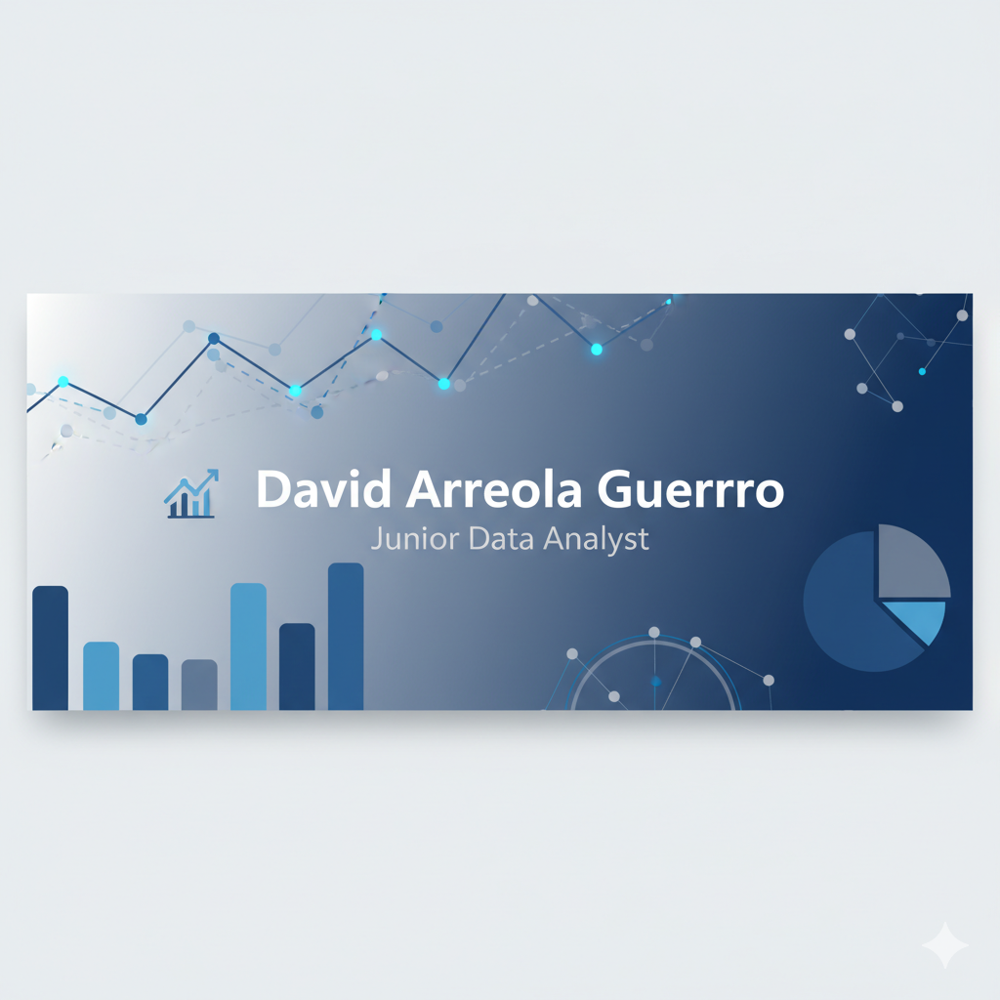
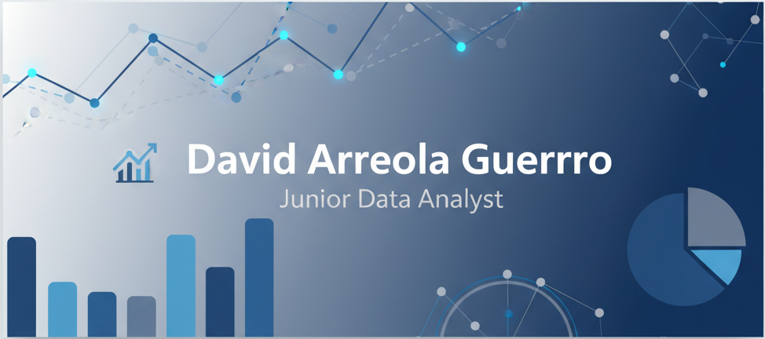

<!--
**Davagid/Davagid** is a ✨ _special_ ✨ repository because its `README.md` (this file) appears on your GitHub profile.

Here are some ideas to get you started:

- 🔭 I’m currently working on ...
- 🌱 I’m currently learning ...
- 👯 I’m looking to collaborate on ...
- 🤔 I’m looking for help with ...
- 💬 Ask me about ...
- 📫 How to reach me: ...
- 😄 Pronouns: ...
- ⚡ Fun fact: ...
-->
<!--

-->

  

## 👋 Sobre mí

¡Hola! Soy **David Arreola Guerrero**, ¡un gusto!  
Soy **Analista de Datos Jr.** con formación reciente en análisis, visualización e interpretación de datos, egresado del **bootcamp de Análisis de Datos de TripleTen**.  

Antes de dedicarme a los datos, trabajé como **compositor de efectos visuales** en Vancouver, Canadá, donde desarrollé una gran atención al detalle, disciplina y una mentalidad orientada a resultados.

💡 Hoy aplico esas mismas habilidades para **transformar datos en historias claras y útiles**, utilizando herramientas como **Python (Pandas, NumPy, Matplotlib)**, **SQL**, **Tableau** y **Excel**.  
Disfruto del proceso completo: limpiar, analizar y comunicar hallazgos que aporten valor y faciliten la toma de decisiones.

🎬 Mi experiencia en entornos internacionales me enseñó a colaborar con equipos multiculturales y gestionar proyectos complejos bajo altos estándares de calidad, adaptándome a todo tipo de desafíos y contextos.

📊 Actualmente busco integrarme a un equipo donde pueda seguir desarrollando mis habilidades, aprendiendo nuevas técnicas, aportando desde la curiosidad analítica y contribuyendo con soluciones basadas en evidencia.

> “Los datos cuentan una historia; mi trabajo es ayudar a que todos puedan entenderla y tomar mejores decisiones.”

---

### 🛠️ Tecnologías y herramientas

<!--Forma más "LIMPIA"

> **Librerías principales:** Pandas · NumPy · Matplotlib · Seaborn · SciPy · scikit-learn
-->
#### 💻 Lenguaje

#### 📊 Librerías de análisis y visualización

#### 🗄️ Bases de datos y visualización

---

### 📂 En este perfil encontrarás
- Proyectos de análisis exploratorio y visualización de datos  
- Dashboards interactivos y reportes automatizados  
- Casos prácticos de limpieza, transformación y *storytelling* con datos

---

### 🌐 Conecta conmigo

